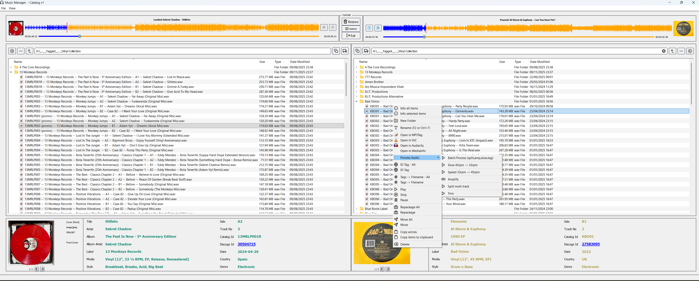
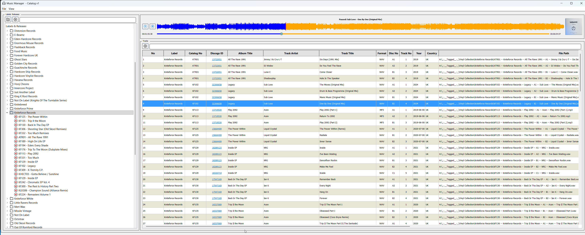

# Music Catalogue

> **Status**: Active development — database integration in progress, production hardening underway on `dev/production-ready` branch.

A Windows desktop application for streamlining the digitisation and cataloguing of vinyl records. Built with Python and PyQt5.

---

## History

Music Catalogue started as a personal project to streamline the process of backing up vinyl records to a PC. The initial process involved several manual steps:

1. Record an LP into Audacity as a single recording at 45rpm to speed up recording.
2. Remove needle drops and clicks from flipping the record over.
3. Slow the recording to the original speed of 33rpm.
4. Amplify the recording to improve volume.
5. Mark the start and end of each track.
6. Export the tracks as WAV files.
7. Open tracks in MP3 Tag.
8. Find the release ID on Discogs.
9. Tag the tracks with the release ID.
10. Rename the file name of the tracks — catalog id, label, artist, title etc.
11. Copy the tracks to a folder with the label as the name.

The initial goal was a single UI with two file explorers for easy file management. This evolved into a fuller application with track playback, tag display, artwork display, automated batch processing, and a music database.

The current process is much more streamlined:

1. Record an LP into Audacity as a single recording at 45rpm to speed up recording.
2. Remove needle drops and clicks from flipping the record over.
3. Find the release ID on Discogs.
4. Save the file with the release ID and original speed in the filename.

Everything else is now automated with a single click:

- Amplifying the recording
- Slowing down the recording
- Splitting the recording into tracks
- Tagging the tracks based on the Discogs ID
- Adding artwork
- Renaming filenames of the tracks
- Repacking the tracks into a folder by label

Each operation can also be performed separately if needed.

---

## Features

### Working / Stable
- **Dual File Explorer** — twin-panel file browser for easy file management
- **Automated Batch Processing** — amplify, slow down, split, tag, rename, and repack in one click
- **Manual Control** — each operation available individually; amplify and trim also work on files without a Discogs release ID
- **Discogs Integration** — auto-tag tracks using a Discogs release ID
- **Track Playback** — built-in media player with waveform visualisation; previewing a track no longer locks the file, so tags and artwork can still be written while it is loaded
- **Waveform Editor** — right-click a wav → *Edit Waveform...*: zoom (selection-aware) and scroll the waveform, drag to select a region, cut it out or trim to it, undo, and save over the original or as a copy (tags and artwork preserved). Selections play as a loop, spacebar pauses/restarts, and selection edges can be grabbed and dragged to resize
- **Tag & Artwork Display** — view and inspect track metadata
- **File Management** — move, copy, delete with recycle bin support; copy a selected file's full path or filename to the clipboard from the context menu
- **3rd Party Tool Integration** — open files directly in Audacity, Mp3Tag, VLC, and MediaInfo (must be installed separately)

### In Progress / Experimental
- **Database** — scan music collection and build a searchable database (`db/` module, integration in progress). Browsed via the DB Viewer page: labels & releases tree, track table, and built-in media player with waveform. (The separate DB Manager page has been removed in favour of the DB Viewer.)
- **Trim** — remove leading silence from a track (implemented, experimental — see notes below)
- **Settings Dialog** — UI exists but changes are not yet persisted back to `config.ini`
- **Configuration Manager** — skeleton exists, not yet wired up

### Known Limitations
- **Windows only** — uses `winshell`, `pywin32`, and Windows-specific paths
- **Trim thresholds are workflow-tuned** — silence detection (with a 100&nbsp;ms pre-start buffer) is tuned for vinyl recordings; on already-mastered files it may find nothing to trim — use the Waveform Editor for manual cuts instead
- **External tools must be installed** — Mp3Tag, VLC, Audacity, MediaInfo, K-Lite Codec Pack

---

## Requirements

### Python
Tested on Python 3.10.4. Requires Python 3.10 or later.

### Python Dependencies

```
pip install mutagen
pip install pytaglib
pip install pydub
pip install PyQt5
pip install qtpy
pip install pydantic
pip install numpy
pip install discogs_client
pip install winshell
pip install pywin32
pip install send2trash
```

### External Tools (must be installed separately)
These are integrated via subprocess calls. Paths are expected at their default installation locations.

| Tool | Purpose | Default Path |
|------|---------|-------------|
| [SOX](https://sourceforge.net/projects/sox/) | Audio processing | bundled in `utils/sox/` |
| [SoundStretch](http://www.surina.net/soundtouch/soundstretch.html) | Time-stretching | bundled in `utils/` |
| [Audacity](https://www.audacityteam.org/) | Manual audio editing | `C:\Program Files\Audacity\` |
| [Mp3Tag](https://www.mp3tag.de/) | Metadata editing | `C:\Program Files\Mp3tag\` |
| [VLC](https://www.videolan.org/vlc/) | Media playback | `C:\Program Files\VideoLAN\VLC\` |
| [MediaInfo](https://mediaarea.net/en/MediaInfo) | File analysis | `C:\Program Files (x86)\K-Lite Codec Pack\Tools\` |
| [K-Lite Codec Pack](https://codecguide.com/download_kl.htm) | Media codecs | Required for playback |

---

## Configuration

Copy or create `config.ini` in the project root (it is gitignored — never commit it). Example structure:

```ini
[paths]
default_path = C:/your/music/folder
db_location = C:/your/music/folder/catalogue.db

[discogs]
token = YOUR_DISCOGS_TOKEN_HERE

[logging]
log_dir = logs/
```

### Discogs API Token
The app reads your Discogs token from `config.ini` under `[discogs]`. 

- Keep `config.ini` local only — it is in `.gitignore` and must never be committed.
- If your token was previously committed, rotate it immediately in your [Discogs settings](https://www.discogs.com/settings/developers) and update your local `config.ini`.

---

## Getting Started

```
python src/main_window.py
```

Ensure your working directory is the project root when running the app, as resource paths (UI files, icons) are resolved relative to it.

---

## Branch Strategy

| Branch | Purpose |
|--------|---------|
| `main` | Stable code |
| `dev/production-ready` | Active development — refactoring, tests, CI/CD, Windows executable |
| `baseline-2026-05-15` | Tagged snapshot before production hardening began |

---

## Upcoming / Roadmap

- Complete database integration — full scan, search, and query UI
- Proper Python packaging (`pyproject.toml`, entry points)
- Windows executable build (PyInstaller)
- CI/CD pipeline
- Expanded test coverage
- Settings dialog that persists changes
- Trim integration into main batch process with configurable pre-start buffer
- Configurable external tool paths (rather than hardcoded `Program Files`)

---

## Screenshots




---

## Contributing

Issues, ideas, and feature requests via the [Issues](https://github.com/okeefo/music-catalogue/issues) tab.

---

## License

MIT License — see [LICENSE-MIT](LICENSE-MIT) for details.
